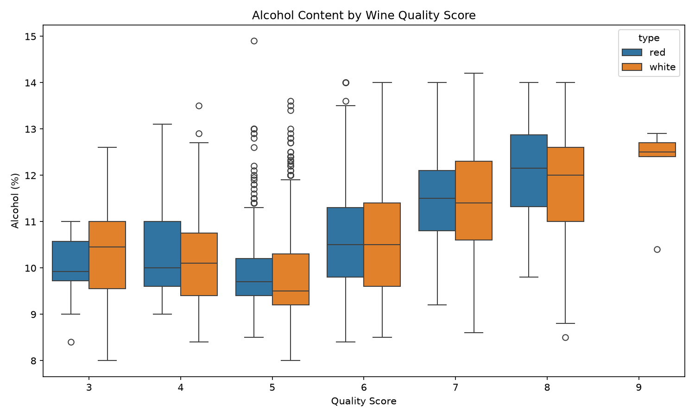
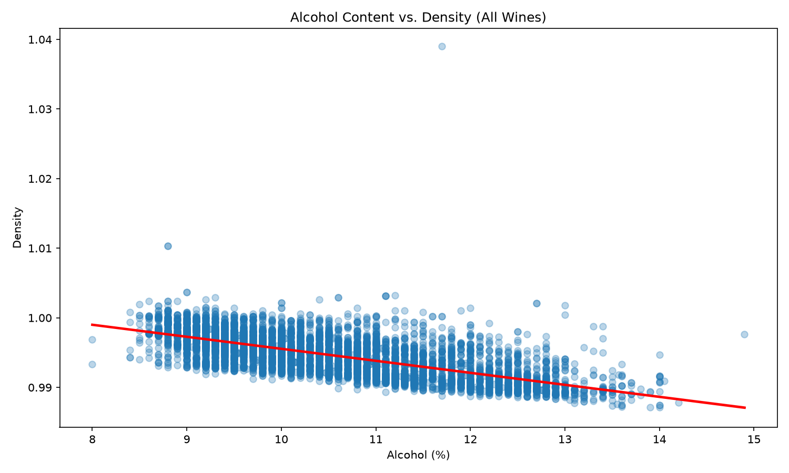

# IDS706---Assignment-2

# Wine Quality Analysis

## Project Goal

This project is focused on practicing the core fundamentals of data analysis using Python and Pandas. Using a real, publicly available dataset, the goal is to work through the full basic workflow a Data Scientist would follow: 
- Loading raw data into a DataFrame
- Inspecting it to understand its structure and quality (data types, missing values, duplicates)
- Filtering and grouping it to answer specific questions about the data
- Training a simple machine learning model to see how well a few variables can predict an
outcome
- Visualizing the results through different types of charts. 

The emphasis throughout is on understanding *why* each step matters, not just running the code.

## The Dataset

**Wine Quality (Red and White)**, sourced from Kaggle:

https://www.kaggle.com/datasets/amirmohamadrezaie/red-and-white-wine-quality

The file `data/wine_quality_merged.csv` contains both red and white wine samples
combined into a single file, with a `type` column that already labels each row as
`"red"` or `"white"`. Each row is one wine sample, described by 11 chemical
measurements, plus a `quality` score from 0–10 assigned by wine tasters. 
The columns are:

`fixed acidity, volatile acidity, citric acid, residual sugar, chlorides, free sulfur
dioxide, total sulfur dioxide, density, pH, sulphates, alcohol, quality, type`

## How to run this

These steps assume you've already cloned this repository and have a terminal open inside the `wine-quality-analysis` folder.

### 1. Create a virtual environment

Run this in the **terminal**:

```bash
python3 -m venv .venv
```

This creates a folder called `.venv` that holds a clean, isolated copy of Python just for this project, so the packages you install don't clash with anything else on your machine.

### 2. Activate the virtual environment

Run this in the **terminal**:

```bash
source .venv/bin/activate
```

You'll know it worked because your terminal prompt will now show `(.venv)` at the start of the line. You need to run this activation command every time you open a new terminal window to work on this project.

### 3. Install the required packages

Run this in the **terminal** (with the virtual environment still active):

```bash
pip install -r requirements.txt
```

This reads the `requirements.txt` file in this repo and installs the four libraries the script needs: `pandas`, `matplotlib`, `seaborn`, and `scikit-learn`.

### 4. Add the dataset

This is a **file/folder step, not a terminal command**: 
Make sure `wine_quality_merged.csv` is placed inside a folder named `data/`, sitting right next to `analysis.py`. The folder structure should look like this:

```
wine-quality-analysis/
├── analysis.py
├── data/
│   └── wine_quality_merged.csv
├── graphs/
├── requirements.txt
├── Makefile
└── README.md
```

If you don't have the dataset yet, download it from the Kaggle link in the "Dataset" section above and place it in the `data/` folder.

### 5. Run the script

Run this in the **terminal**:

```bash
python analysis.py
```

This runs every step of `analysis.py` from top to bottom: it loads the dataset, prints inspection details, prints the filtering and grouping results, trains the model and prints its performance, and finally saves two charts.

### 6. Check the output

You don't need to run anything for this step. Just look at what happened:

- All the printed results (row counts, `.describe()` output, filter counts, group tables, model error and R-squared) appear directly in your **terminal**.
- Two image **files** are created inside the `graphs/` folder: `graphs/quality_vs_alcohol.png` and `graphs/alcohol_vs_density.png`. Open these from VS Code's file explorer (or any image viewer) to see the charts.

### Optional: using the Makefile shortcuts

If you'd rather not type each command separately, this repo includes a `Makefile` with shortcuts. These also run in the **terminal**:

- `make setup` - creates the virtual environment and installs the requirements (does steps 1–3 for you)
- `make run` - runs the script (does step 5 for you)
- `make clean` - deletes the generated charts and cached Python files, useful if you want a fresh run

---

## Step-by-step walkthrough

### Step 1: Importing the dataset

**What this step does:** 

Loads the single merged CSV file into a pandas DataFrame (a table) and takes a first look at how the two wine types are represented in it.

```python
wine = pd.read_csv("data/wine_quality_merged.csv")
print(f"Total rows: {len(wine)}")
print(wine["type"].value_counts())
```

**What we found:** 

*The dataset has 6,497 wines total.*
*4,898 white (about 75%) and 1,599 red (about 25%), so white wines make up the large majority of the combined file.*

---

### Step 2: Inspecting the Data

**What this step does:** 

Looks at the data's structure and health before doing any
real analysis. What the columns look like, what type of data each holds, and whether
anything is missing or duplicated.

```python
print(wine.head())
print(wine.info())
print(wine.describe())
print("Missing values:")
print(wine.isnull().sum())
print(f"Duplicate rows: {wine.duplicated().sum()}")
```

**What we found:** 

*No column has any missing values. Every one of the 13 columns shows 0 missing across all 6,497 rows.*
*There are, however, 1,177 exact duplicate rows (about 18% of the dataset), rows that repeat another row's values identically.* 
*.describe() shows that most chemical measurements are fairly tight (e.g. alcohol ranges from 8.0% to 14.9%, averaging 10.49%), but residual sugar is heavily skewed: its 75th percentile is 8.1 but its maximum is 65.8, meaning a small number of unusually sweet wines pull the average up.*

---

### Step 3: Filtering

**What this step does:** 

Pulls out five different meaningful subsets of the data,
using `.query()` to write each condition as plain text. This shows filtering on a
single numeric range, a combined range, and combined conditions across two columns
(type *and* alcohol) at once.

```python
high_quality = wine.query("quality >= 7")
bad_quality = wine.query("quality <= 4")
medium_quality = wine.query("quality > 4 and quality < 7")
high_alcohol_red = wine.query("type == 'red' and alcohol > 12")
low_alcohol_red = wine.query("type == 'red' and alcohol < 10")
```

**What we found:** 

If we consider alcohol quality, out of 6,497 wines: 
- 1,277 (about 20%) are high quality (score ≥ 7)
- 246 (about 4%) are bad quality (score ≤ 4)
- the remaining 4,974 (about 77%) fall in the medium range
*So most wines cluster around average quality, and truly bad wines are rare.* 

Secondly, among red wines specifically:
- 141 (about 9% of all reds) have alcohol above 12%
- 680 (about 43% of all reds) have alcohol below 10%
*Therefore, lower-alcohol reds are considerably more common than higher-alcohol ones.*

---

### Step 4: Grouping

**What this step does:** 

Splits the dataset into groups and computes summary
statistics for each group. First by wine type, and then by quality score.

```python
by_type = wine.groupby("type").agg(
    avg_alcohol=("alcohol", "mean"),
    avg_quality=("quality", "mean"),
    no_of_wines=("quality", "count"),
)

by_quality = wine.groupby("quality").agg(
    avg_alcohol=("alcohol", "mean"),
    no_of_wines=("alcohol", "count"),
)
```

**What we found:** 

*White wines average a slightly higher quality score than red (5.88 vs. 5.64) despite very similar average alcohol content (10.51% vs. 10.42%).*
*White also shows more variation in alcohol (std 1.23 vs. 1.07).* 
*The alcohol-by-quality relationship isn't perfectly straight-line: quality scores 3 and 4 actually have slightly higher average alcohol (10.2%) than quality 5 (9.8%, the lowest point in the table), but from quality 5 upward the trend climbs steadily and clearly:* 
*9.8% → 10.6% → 11.4% → 11.7% → 12.2% across quality 5 through 9. Overall, higher-quality wines do tend to have more alcohol, especially in the upper half of the range.*

---

### Step 5: Machine Learning model

**What this step does:** 

Trains a Linear Regression model, the simplest predictive
model there is. To predict a wine's quality score from three of its chemical
properties, then measures how good its predictions were on data it never saw during
training.

```python
features = ["alcohol", "volatile acidity", "sulphates"]
X = wine[features]
y = wine["quality"]

X_train, X_test, y_train, y_test = train_test_split(
    X, y, test_size=0.2, random_state=42
)

model = LinearRegression()
model.fit(X_train, y_train)
predictions = model.predict(X_test)

mse = mean_squared_error(y_test, predictions)
r2 = r2_score(y_test, predictions)
```

Each feature's learned coefficient is then printed with a loop:
```python
for feature, coef in zip(features, model.coef_):
    print(f"{feature}: {coef:.3f}")
```
`model.coef_` holds one number per feature, in the same order as `features`; `zip()`
pairs each feature name with its coefficient so the loop can print both together. A
positive coefficient means "as this feature goes up, predicted quality tends to go up
too"; negative means the opposite.

**What we found:** 

*The model's Mean Squared Error was 0.551 and R-squared was 0.253*

*These three features (alcohol, volatile acidity, sulphates) explain about 25% of the variation in quality, a real but modest amount, since quality clearly depends on more than three chemical measurements.* 

- *Volatile acidity had by far the strongest effect (coefficient −1.466): as it increases, predicted quality drops sharply, consistent with volatile acidity being linked to a vinegar-like taste.* 
- *Sulphates (+0.641) and alcohol (+0.322) both had smaller, positive effects. More of either tends to predict slightly higher quality.*

---

### Step 6: Visualization - Boxplot

**What this step does:** 

Draws a boxplot comparing alcohol content across quality scores, split by wine type.

```python
sns.boxplot(data=wine, x="quality", y="alcohol", hue="type")
```

**Why alcohol and quality:** 

Alcohol is one of the three features the model above uses
to predict quality, so this chart lets you *see* that relationship directly instead of
just reading a coefficient. `hue="type"` adds a second comparison for free - red vs. white - on the same chart.

**Why a boxplot?** 

`quality` only takes a handful of whole-number values (3-9), so it behaves like a category rather than a continuous number. A boxplot is built for exactly that: it groups the continuous variable (alcohol) by each discrete category (quality score) and shows the median, spread, and outliers for every group side by side, which a scatter plot can't do cleanly with so few x-values.

**What we found:** 

*The boxplot's pattern matches the by_quality numbers above: alcohol content generally climbs as quality score increases, most clearly from quality 5 onward, and the trend looks broadly similar for red and white, though white's boxes show a bit more spread at the low end.*



---

### Step 7: Visualization - Scatter Plot

**What this step does:** 

Adds a second chart, this time comparing two continuous
chemical properties directly against each other rather than against the discrete
quality score.

```python
plt.figure(figsize=(10, 6))
sns.regplot(data=wine, x="alcohol", y="density", scatter_kws={"alpha": 0.3}, line_kws={"color": "red"})
plt.title("Alcohol Content vs. Density (All Wines)")
plt.xlabel("Alcohol (%)")
plt.ylabel("Density")
plt.tight_layout()
plt.savefig("graphs/alcohol_vs_density.png", dpi=150)
print("Scatter plot with trend line saved as alcohol_vs_density.png")
```

**Why alcohol and density (and not quality again):** 

`quality` only takes whole numbers from 3 to 9, so a scatter plot with `quality` on an axis produces vertical
stripes of points rather than a smooth cloud. A boxplot (Step 6) is the better tool
for that comparison. Alcohol and density are both continuous measurements, and wine
chemistry gives a real reason to expect a relationship between them: alcohol is less
dense than water, so wines with more alcohol tend to have lower density. That makes
this pair a clearer, more classic example of what a scatter plot is for. This version
also combines red and white into one group rather than splitting by `hue="type"`, to
show the overall trend across every wine at once.

**What we found:** 

*The scatter plot shows a clear inverse relationship.*
*As alcohol content goes up, density tends to go down. The red trend line slopes downward across the whole range, confirming this. Most points are tightly packed in a diagonal band between about 8–14% alcohol and a density of 0.99–1.00, which makes sense chemically: alcohol is less dense than water, so wines with more alcohol are naturally less dense.*
*There are a few outliers worth noting though. One wine near 11.5% alcohol has an unusually high density (about 1.04), and one near 8.8% alcohol sits at about 1.01, both well above the rest of the cloud. Aside from those outliers, the relationship is fairly consistent and fits a straight line reasonably well, though the points do fan out a bit more at the lower end of alcohol content than at the higher end. Check out graphs/alcohol_vs_density.png yourself below and confirm.*



---

## Overall Findings

*Across the dataset, white wines slightly outperform red on average quality (5.88 vs. 5.64), despite nearly identical average alcohol.* 
*Alcohol content is genuinely useful for predicting quality, visible both in the by_quality trend and in the regression model.*
*However, volatile acidity matters more, and in the opposite direction: it's the strongest single predictor of lower quality among the three features tested. The 3-feature linear model captures a real signal (R² = 0.253) but is far from complete, which makes sense, since wine quality is a subjective taster's judgment shaped by more factors than alcohol, volatile acidity, and sulphates alone.*
*A model with more features or a non-linear algorithm would likely do meaningfully better.*


## Next Steps (for later weeks)

- Try more features in the regression model, or a different algorithm (e.g., Random
  Forest).
- Compare Pandas performance against Polars on this same dataset.
- Add tests and set up continuous integration (CI) for this script.


Add images of graphs to the readme file
Make a table of contents
Things we should have worked on (check from Kedar's work)

Why the specific plot?
What we got out of it?